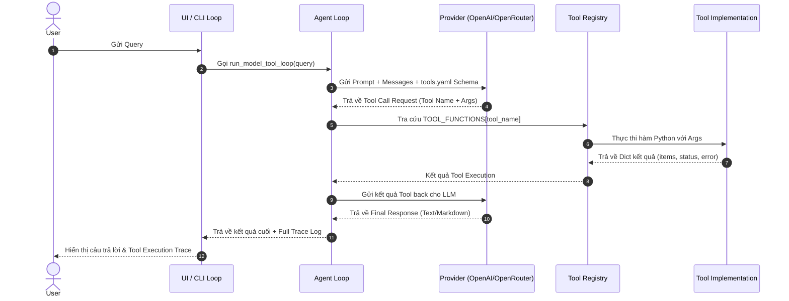

# Architecture Document — Research Agent Tool Eval

Tài liệu này mô tả chi tiết kiến trúc kỹ thuật của hệ thống **Research Agent & Evaluation Pipeline** (`starter_v0`).

---

## 1. System Overview & Tech Stack (Tổng quan & Công nghệ)

Hệ thống được thiết kế theo kiến trúc mô-đun hóa (Modular Architecture), phân tách rõ ràng giữa:
- **LLM Provider Layer:** Lớp trừu tượng kết nối với các mô hình ngôn ngữ lớn (OpenAI, OpenRouter, Anthropic, Gemini).
- **Agent Engine & Tool Registry:** Trình quản lý vòng lặp suy luận và thực thi công cụ linh hoạt.
- **Evaluation Engine:** Hệ thống tự động kiểm thử và tính toán chỉ số chính xác dựa trên bằng chứng dữ liệu.
- **Presentation Layer:** Giao diện người dùng Web (Streamlit) & CLI.

```
+-------------------------------------------------------------------+
|                        Presentation Layer                         |
|             CLI (chat.py)     |     Web UI (app.py)               |
+-------------------------------------------------------------------+
                                  |
                                  v
+-------------------------------------------------------------------+
|                           Agent Engine                            |
|        run_model_tool_loop() / System Prompt / tools.yaml         |
+-------------------------------------------------------------------+
             |                                          |
             v                                          v
+------------------------+             +----------------------------+
|   LLM Provider Layer   |             |   Tool Registry & Exec     |
| (OpenAI / OpenRouter)  |             | (lookup, fetch, team_tool) |
+------------------------+             +----------------------------+
                                                    |
                                                    v
                                       +----------------------------+
                                       |    External Service APIs   |
                                       | (Tavily, Firecrawl, etc.)  |
                                       +----------------------------+
```

### Công nghệ sử dụng:
- **Ngôn ngữ cốt lõi:** Python 3.10+
- **LLM Integrations:** `openai`, `anthropic`, `google-genai`
- **Web UI Framework:** `streamlit >= 1.30.0`
- **External Tool SDKs & APIs:** Tavily API, Firecrawl API, RapidAPI Twitter API45, PyPDF (`pypdf`), PyYAML.

---

## 2. Component Architecture (Các Thành phần Hệ thống)

### 2.1. Provider Abstraction (`providers/`)
Lớp tương thích hóa giao diện gọi LLM API. Tất cả provider tuân thủ interface chuẩn `ModelResponse` và `ToolCall`.
- `providers/base.py`: Định nghĩa Dataclass chuẩn cho `ModelResponse` và `ToolCall`.
- `providers/openai_provider.py`: Xử lý giao tiếp với OpenAI Chat Completions API (`gpt-4o-mini`, v.v.).
- `providers/openrouter_provider.py`: Kế thừa từ `OpenAIProvider`, cấu hình `base_url` kết nối qua cổng OpenRouter.

### 2.2. Agent Core & Tool Execution Engine (`starter_v0/`)
- `artifacts/system_prompt.md`: Chứa câu lệnh hướng dẫn chính (System Instruction) cho Agent.
- `artifacts/tools.yaml`: Khai báo tên, mô tả chi tiết, quy tắc sử dụng và JSON Schema tham số cho từng tool.
- `tools/__init__.py`: Registry tập trung (`TOOL_FUNCTIONS`), tự động ánh xạ từ tên tool sang hàm thực thi Python tương ứng.
- `tools/<tool_name>/`: Mỗi tool nằm trong một thư mục riêng biệt chứa file mã nguồn `.py` và file tài liệu hợp đồng `TOOL.md`.

### 2.3. Evaluation & Analysis Subsystem (`run_eval.py`, `scripts/`)
- `run_eval.py`: Engine tự động đọc tập các eval case (`data/*.json`), gọi Agent qua từng turn, so sánh kết quả thực tế (`actual_tool_calls`) với mong đợi (`expected`), sau đó xuất báo cáo chi tiết.
- `scripts/preflight_provider.py`: Script kiểm tra tiền điều kiện kết nối API Key và tính năng gọi tool của LLM Provider.
- `scripts/parse_runs.py`: Đọc các file nhật ký `runs/*.json` và chuyển đổi thành bảng dữ liệu phẳng CSV (`analysis/`) phục vụ phân tích chuyên sâu.

### 2.4. Audit Logging & Artifact Storage (`artifacts/`, `runs/`, `transcripts/`)
- `artifacts/version_log.csv`: Bảng nhật ký kiểm soát phiên bản từ `v0` đến `v3`, ghi lại Prompt Hash, Tools Hash, Giả thuyết và chỉ số Accuracy.
- `runs/*.json`: Lưu kết quả chi tiết từng case kiểm thử trong các đợt chạy eval suite.
- `transcripts/*.json`: Lưu vết lịch sử cuộc hội thoại thực tế khi người dùng tương tác qua `chat.py` hoặc `app.py`.

---

## 3. Data Flow (Luồng Dữ liệu)

### Luồng xử lý một lượt hỏi đáp (Single Turn Data Flow):



---

## 4. Storage & File Organization Strategy (Chiến lược Lưu trữ File)

| Đường dẫn file / thư mục | Loại dữ liệu | Mục đích sử dụng |
| :--- | :--- | :--- |
| `starter_v0/.env` | Secrets (Private) | Lưu trữ các chuỗi API Key (`OPENAI_API_KEY`, `TAVILY_API_KEY`...). Không commit lên Git. |
| `artifacts/system_prompt.md` | Configuration | Prompt hệ thống của Agent. Được băm SHA-256 (`prompt_hash`) để kiểm định phiên bản. |
| `artifacts/tools.yaml` | Configuration | Khai báo các Tool mà Agent được phép dùng. Được băm SHA-256 (`tools_hash`). |
| `artifacts/version_log.csv` | Audit Log | Lưu nhật ký cải tiến qua các phiên bản `v0` $\rightarrow$ `v3`. |
| `data/eval_base.json` | Test Dataset | Tập dữ liệu kiểm thử chuẩn cố định ban đầu. |
| `data/eval_group.json` | Test Dataset | Tập 10 dữ liệu kiểm thử do chính nhóm thiết kế. |
| `runs/*.json` | Output Audit | Nhật ký chạy eval chi tiết làm bằng chứng cho Báo cáo `REPORT.md`. |
| `transcripts/*.json` | Session Log | Nhật ký các phiên trò chuyện tương tác live với người dùng. |
