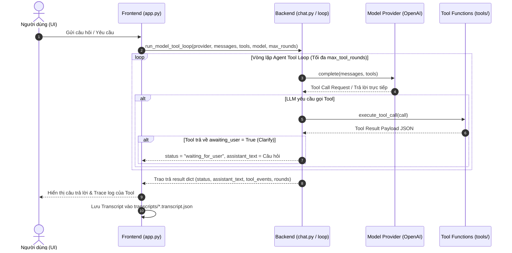

# 🔌 Frontend - Backend Integration & API Specification Document

Tài liệu này hướng dẫn chi tiết về kiến trúc tích hợp giữa giao diện Web UI Streamlit (`frontend/app.py`) và hệ thống xử lý Backend Agent (`chat.py`, `providers/`, `tools/`).

---

## 1. Tổng quan Kiến trúc Giao tiếp (Communication Architecture)

Frontend đóng vai trò **Presentation Layer**, nhận thông tin từ người dùng và ủy quyền toàn bộ vòng lặp tư duy/gọi Tool cho Backend thông qua hàm `run_model_tool_loop`.



---

## 2. API Data Contracts (Hợp đồng Dữ liệu)

### 2.1. Request Contract (Input cho Backend Loop)

Frontend gọi hàm `run_model_tool_loop()` với các tham số bắt buộc như sau:

| Tham số | Kiểu dữ liệu | Mô tả |
|---|---|---|
| `provider` | `BaseProvider` | Đối tượng Provider đã khởi tạo (VD: `make_provider("openai")`) |
| `messages` | `list[dict[str, str]]` | Danh sách tin nhắn dạng `[{"role": "system"\|"user"\|"assistant", "content": "..."}]` |
| `tools` | `list[dict[str, Any]]` | Danh sách định dạng Tool OpenAI sinh từ `to_openai_tools(load_tool_declarations(tools_path))` |
| `model` | `str \| None` | Tên model cụ thể (VD: `gpt-4o-mini`) hoặc `None` để dùng mặc định |
| `max_tool_rounds` | `int` | Số vòng lặp tối đa gọi tool liên tiếp (mặc định: `4`) |

---

### 2.2. Response Contract (Output trả về cho Frontend)

Hàm `run_model_tool_loop()` **bắt buộc** trả về một `dict` đúng cấu trúc chuẩn sau:

```typescript
interface AgentLoopResult {
  // Trạng thái kết thúc của vòng lặp
  status: "answered" | "waiting_for_user" | "max_tool_rounds";
  
  // Văn bản phản hồi cuối cùng hiển thị cho User
  assistant_text: string;
  
  // Danh sách các sự kiện Tool đã thực thi
  tool_events: Array<{
    tool: string;              // Tên tool được gọi (VD: "social_search", "clarify")
    args: Record<string, any>; // Các đối số truyền vào tool
    result: Record<string, any>; // Kết quả hoặc JSON lỗi do tool trả về
  }>;
  
  // Chi tiết từng round tư duy của Model
  rounds: Array<{
    round: number;
    assistant_text: string | null;
    tool_calls: Array<{ name: string; args: Record<string, any> }>;
    tool_results: Array<ToolEvent>;
  }>;
}
```

#### Quy ước về trạng thái `status`:
1. `"answered"`: Agent đã hoàn thành câu trả lời và không cần gọi thêm tool nào.
2. `"waiting_for_user"`: Agent gọi tool `clarify` để yêu cầu xác nhận yes/no hoặc hỏi thêm chi tiết. Frontend sẽ hiển thị banner thông báo nổi bật (`clarification-banner`).
3. `"max_tool_rounds"`: Đã chạm ngưỡng `max_tool_rounds` mà Agent chưa hoàn tất.

---

## 3. Quy ước Lỗi (Standardized Error Schema)

Khi một Tool xảy ra ngoại lệ hoặc trả về lỗi, Backend **không crash** mà đóng gói kết quả lỗi theo format thống nhất trong field `result`:

```json
{
  "tool": "social_search",
  "args": { "query": "OpenAI", "limit": 5 },
  "result": {
    "error": "APIKeyMissingError",
    "message": "RAPIDAPI_KEY is not configured in .env file."
  }
}
```

Frontend sẽ tự động phát hiện key `"error"` trong `result` và chuyển trạng thái thẻ Tool Trace sang nhãn **`ERROR` (Pink Badge)**.

---

## 4. Quản lý Phiên bản Artifact & Transcripts

Frontend tương tác với hệ thống quản lý phiên bản (`versioning.py`) như sau:

1. **Định danh phiên bản (`artifact_version`)**:
   - Tạo mã hash kết hợp giữa prompt và tool declaration:
     `build_artifact_version(version_choice, sys_prompt_path, tools_path)`
   - Cấu trúc: `<version_choice>+p<short_prompt_hash>+t<short_tools_hash>` (VD: `v0+p1a2b3c4d5e6+t7f8e9d0a1b2`).

2. **Lưu trữ Transcript (`write_transcript`)**:
   - Mỗi phiên làm việc Chat được lưu lại tự động tại `transcripts/<transcript_id>.transcript.json`.
   - File transcript chứa đầy đủ metadata (`provider`, `model`, `artifact_version`, `turns`, `tool_events`) phục vụ cho việc đánh giá eval.

---

## 5. Hướng dẫn dành cho Backend Developer khi thêm Tool mới

Để thêm một Tool mới mà Frontend có thể nhận diện và hiển thị mượt mà **không cần chỉnh sửa code Frontend**:

1. **Tạo Tool Implementation**:
   - Viết hàm xử lý trong `tools/<tool_name>/tool.py`.
   - Đăng ký hàm vào `TOOL_FUNCTIONS` trong `tools/__init__.py`.

2. **Khai báo Schema trong `artifacts/tools.yaml`**:
   ```yaml
   - name: my_new_tool
     description: "Mô tả mục đích của tool..."
     parameters:
       type: object
       properties:
         query:
           type: string
           description: "Từ khóa tìm kiếm"
       required: ["query"]
   ```

3. **Kiểm tra trên Frontend**:
   - Mở tab **`🛠️ Tool Declarations`** trên Web UI để xác nhận Schema hiển thị chính xác.
   - Thử nghiệm câu hỏi ở tab **`💬 Live Agent Chat`** để kiểm tra hiển thị thẻ **Tool Execution Trace**.
